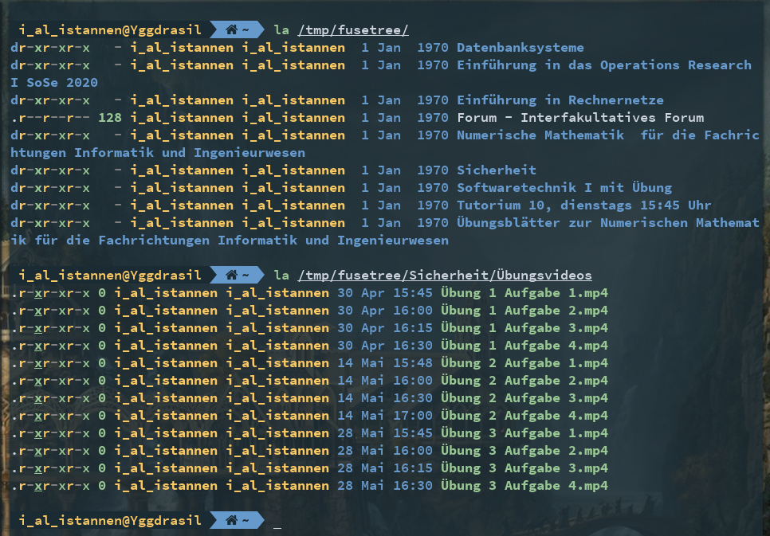

## About

This is a FUSE (Filesystem in user space) wrapper around the KIT ILIAS instance.
It is backed by [PFERD](https://github.com/Garmelon/PFERD), a webscraping file
synchronizer for ILIAS.

It allows you to just mount the ILIAS instance like an external hard drive or
network file system.


## Usage

```sh
python3 filesystem.py /path/to/mount/point
```

### Only mount a specific course

```sh
python3 filesystem.py /path/to/mount/point --course-id <course id>
```
The course id can be found in the URL. Just open the course in your webbrowser
and copy the numerical ID after `ref_id` in the URL.


## Screenshots




## Installation

1. Clone this repository
2. Run the `setup.sh` script to download, patch and install the needed
   dependencies. This script will create a new venv
3. Activate the virtual environment: `. .venv/bin/activate`
4. You can now run the program via `python3 ilias_fuse/filesystem.py`


## Help page
```sh
usage: filesystem.py [-h] [--cookie-file COOKIE_FILE] [--base-url BASE_URL] [--background] [--course-id COURSE_ID | --personal-desktop] mount_dir

positional arguments:
  mount_dir             Where to mount the filesystem

optional arguments:
  -h, --help            show this help message and exit
  --cookie-file COOKIE_FILE
                        The file to store and load cookies in/from. Default: 'cookies.txt'
  --base-url BASE_URL   The base url to the ilias instance. Default: 'https://ilias.studium.kit.edu/'
  --background          Run the fuse mount in the background
  --course-id COURSE_ID
                        The course id to use as the root node
  --personal-desktop    Uses the personal desktop as the root node. The default.
```
